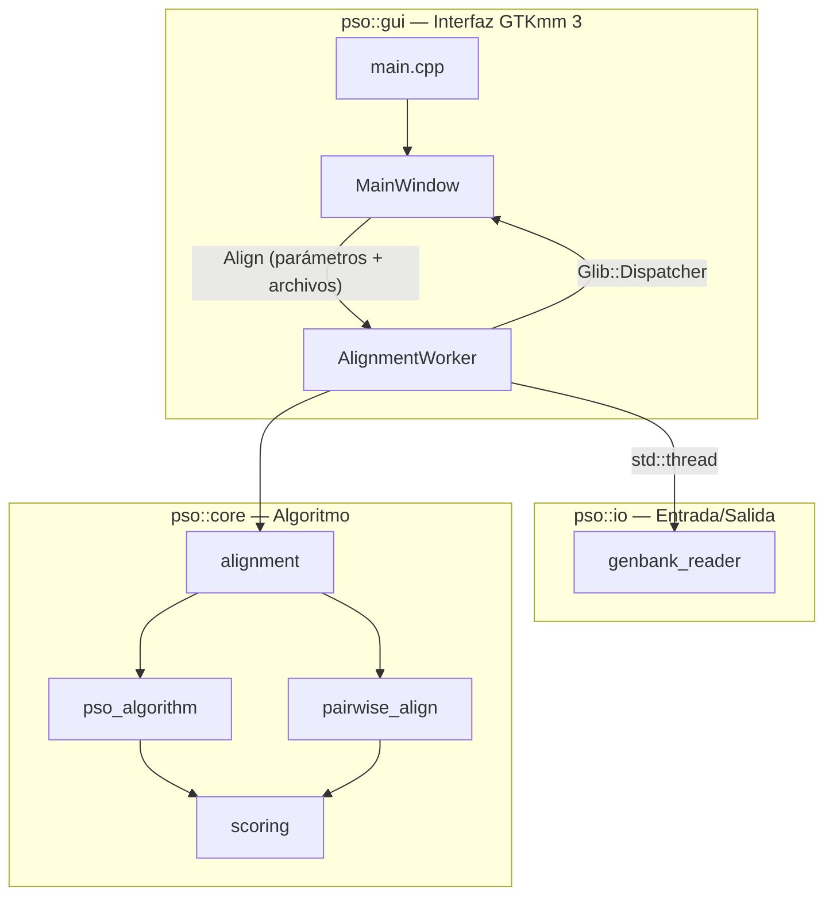
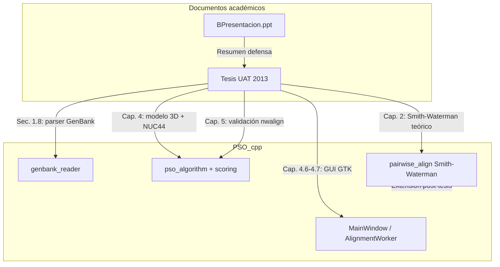

# PSO_cpp — Contexto completo del proyecto

Documento de referencia que consolida el análisis del código, la arquitectura del software y su relación con la tesis y la presentación de defensa.

---

## Índice

1. [Resumen ejecutivo](#1-resumen-ejecutivo)
2. [Identificación académica](#2-identificación-académica)
3. [Problema de investigación](#3-problema-de-investigación)
4. [Arquitectura del software](#4-arquitectura-del-software)
5. [Flujo de ejecución](#5-flujo-de-ejecución)
6. [Capa Core: algoritmos](#6-capa-core-algoritmos)
7. [Capa I/O](#7-capa-io)
8. [Capa GUI](#8-capa-gui)
9. [Parámetros y valores por defecto](#9-parámetros-y-valores-por-defecto)
10. [Documentos de soporte](#10-documentos-de-soporte)
11. [Validación experimental (tesis)](#11-validación-experimental-tesis)
12. [Conclusiones de la investigación](#12-conclusiones-de-la-investigación)
13. [Diferencias: tesis 2013 vs. código actual](#13-diferencias-tesis-2013-vs-código-actual)
14. [Archivos del repositorio](#14-archivos-del-repositorio)
15. [Compilación y ejecución](#15-compilación-y-ejecución)
16. [Trabajo futuro (tesis)](#16-trabajo-futuro-tesis)

---

## 1. Resumen ejecutivo

**PSO Comparator Algorithm V2013GUI** es una aplicación de escritorio en C++ que usa **Optimización por Enjambre de Partículas (PSO)** para encontrar regiones de alta similitud entre dos secuencias de ADN/ARN en formato GenBank (NCBI), y luego aplica **Smith–Waterman** para producir un alineamiento local con gaps en esa región.

| Aspecto | Detalle |
|---------|---------|
| **Propósito** | Comparar secuencias biológicas mediante metaheurística (PSO) + alineamiento clásico |
| **Entrada** | Dos archivos GenBank |
| **Salida** | Mejor región PSO, score, alineamiento con gaps (`\|`, `*`) |
| **Stack** | C++14, GTKmm 3.0, `std::thread`, `Glib::Dispatcher` |
| **Origen académico** | Tesis de maestría UAT, noviembre 2013 |

---

## 2. Identificación académica

| Elemento | Valor |
|----------|-------|
| **Título** | Máximas similitudes en secuencias de ADN mediante el algoritmo de optimización de enjambre de partículas |
| **Autor** | Ing. Eleazar David Sarmiento Torres |
| **Asesora** | Dra. Leticia Flores Pulido |
(agradecimientos en tesis; coautor en README del código) |
| **Programa** | Maestría en Ciencias en Ingeniería en Computación |
| **Institución** | Universidad Autónoma de Tlaxcala (UAT) |
| **Fecha** | Noviembre 2013 |

**Documentos de soporte:**

- Tesis: `/home/davidst/Documents/mic/MCIC/DEFENZA TESIS/tesis_uat_plantilla.pdf`
- Presentación de defensa: `/home/davidst/Documents/mic/MCIC/DEFENZA TESIS/BPresentacion.ppt`

---

## 3. Problema de investigación

### Definición del problema (Cap. 1, tesis)

Formular la búsqueda de la **mejor similitud entre dos secuencias de ADN** como un **problema de optimización**, usando PSO para explorar el subespacio de posibles alineamientos de forma más eficiente que un barrido exhaustivo.

### Hipótesis

Los algoritmos PSO permiten buscar soluciones óptimas en el subespacio de posibles alineamientos. Se puede aplicar PSO para obtener las máximas similitudes entre secuencias de ADN con resultados comparables (o mejores) a métodos clásicos bajo el **mismo esquema de puntuación NUC44**.

### Objetivos

**General:** Implementar un programa con PSO para comparar secuencias de ADN y evaluar la confiabilidad de sus resultados frente a otro algoritmo con la misma matriz de calificación.

**Específicos:**

1. Implementar un algoritmo PSO simple.
2. Llevar el algoritmo a **C++** con interfaz gráfica.
3. Analizar los resultados del algoritmo propuesto.
4. Comparar con **Needleman–Wunsch** (`nwalign` del Bioinformatics Toolbox de MATLAB).

### Metodología

Desarrollo iterativo incremental: preliminares → marco conceptual → trabajos relacionados → modelado PSO → pruebas y análisis.

---

## 4. Arquitectura del software

El proyecto está organizado en **3 capas** bajo el namespace `pso::`:

```
PSO_cpp/
├── src/
│   ├── main.cpp                 # Entrada: GTK + MainWindow
│   ├── core/                    # Algoritmo (sin GUI)
│   │   ├── scoring.h/cpp        # Matriz NUC44, nucleotide_to_int(), drandom()
│   │   ├── pso_algorithm.h/cpp  # PSO, fitness_nuc44()
│   │   ├── pairwise_align.h/cpp  # Smith–Waterman con gaps
│   │   └── alignment.h/cpp      # Orquestación: PSO → Smith–Waterman
│   ├── io/
│   │   └── genbank_reader.h/cpp # Lectura de archivos GenBank
│   └── gui/
│       ├── main_window.h/cpp    # Ventana principal GTKmm
│       └── alignment_worker.h/cpp # Hilo en background
├── Makefile
├── README.md
└── PSOGUI.glade                 # UI Glade legacy (no usada por el código actual)
```

### Diagrama de capas



| Capa | Namespace | Responsabilidad |
|------|-----------|-----------------|
| Entrada | — | Inicia GTK y la ventana principal |
| GUI | `pso::gui` | UI, parámetros PSO, hilo en background |
| I/O | `pso::io` | Lectura de secuencias GenBank |
| Core | `pso::core` | PSO, fitness NUC44, Smith–Waterman |

---

## 5. Flujo de ejecución

1. El usuario elige dos archivos (Query y Subject) y opcionalmente ajusta parámetros PSO.
2. Al pulsar **Align**, `MainWindow` pasa rutas y parámetros a `AlignmentWorker`.
3. `AlignmentWorker` lanza un **`std::thread`** para no bloquear la GUI.
4. En el hilo de trabajo:
   - Carga las secuencias con `load_sequence_from_genbank()`.
   - Llama a `core::align_sequences()`.
5. Al terminar, `Glib::Dispatcher` notifica al hilo principal y se muestra el resultado en el área de texto.

### Flujo descrito en la tesis (Secc. 1.8)

```
GUI → Parser GenBank → PSO + NUC44 → Salida (puntaje + alineamiento)
```

El código actual sigue este flujo y añade Smith–Waterman después del PSO.

---

## 6. Capa Core: algoritmos

### 6.1 Representación del problema (3 dimensiones)

Cada partícula del PSO es un vector **(k, j, len)**:

| Dimensión | Significado |
|-----------|-------------|
| **k (x₁)** | Posición de inicio en la secuencia query |
| **j (x₂)** | Posición de inicio en la secuencia subject |
| **len (x₃)** | Longitud del fragmento a comparar |

Esto define un espacio de búsqueda **ℝ³** (discretizado) para encontrar la ventana de máxima similitud.

### 6.2 Función de fitness (`fitness_nuc44`)

- Compara nucleótidos **posición a posición sin gaps**.
- Usa la matriz **NUC44** (15×15: A, T, G, C y ambigüedades IUPAC).
- Factor de escala: **`NUC44_FACTOR = 0.277316`** (Durbin et al., 2002), para que los scores sean comparables con `nwalign`/`swalign` de MATLAB.

```cpp
// src/core/scoring.h
constexpr double NUC44_FACTOR = 0.277316;
```

La matriz NUC44 está definida en `src/core/scoring.cpp` (15×15).

### 6.3 Algoritmo PSO (`basic_pso`)

Implementación clásica con:

- Población inicial aleatoria en `[min, max]` por dimensión.
- Velocidades con límites `vmin` / `vmax`.
- Actualización estándar:
  - `v = w*v + c1*r1*(pbest - x) + c2*r2*(gbest - x)`
  - `x = x + v`
- Seguimiento de **pbest** (mejor personal) y **gbest** (mejor global).
- Registro en cada iteración de la mejor partícula y su fitness.
- Complejidad documentada en tesis: **O(M × N)** donde M = población, N = iteraciones.

### 6.4 Orquestación (`align_sequences`)

1. Define bounds para (k, j, len) según longitudes de las secuencias.
2. Ejecuta `basic_pso()` con `fitness_nuc44`.
3. Extrae la mejor región `(k, j, len)` con mínimo de 15 bases.
4. Obtiene subcadenas `window1` y `window2`.
5. Aplica **Smith–Waterman** con penalización afín de gaps (apertura −5, extensión −1).
6. Imprime alineamiento con `|` (match) y `*` (mismatch).

**Idea clave:** PSO resuelve búsqueda global (¿dónde alinear?); Smith–Waterman refina localmente con gaps.

### 6.5 Smith–Waterman (`pairwise_align`)

- Alineamiento **local** con gaps (penalización afín).
- Matriz NUC44 para sustituciones.
- Traza backtracking para reconstruir secuencias alineadas.
- `print_alignment_with_gaps()` formatea la salida en bloques de 70 caracteres.

---

## 7. Capa I/O

### `load_sequence_from_genbank()`

Lee archivos en formato GenBank (NCBI):

1. Busca la sección **`ORIGIN`**.
2. Ignora números de línea.
3. Concatena tokens de nucleótidos.
4. Termina al encontrar **`//`**.

Archivo: `src/io/genbank_reader.cpp`

---

## 8. Capa GUI

### `MainWindow`

Construye la UI programáticamente en C++ (no usa `PSOGUI.glade`):

| Componente | Función |
|------------|---------|
| Query String | Selector de archivo (secuencia 1) |
| Subject String | Selector de archivo (secuencia 2) |
| Align | Inicia el alineamiento |
| Population | Tamaño de la población PSO |
| Dimensions | Dimensiones (3, fijo) |
| Iterations | Número de iteraciones |
| c1, c2 | Factores de aceleración cognitiva y social |
| w | Peso de inercia |
| Output | Área de texto monoespaciada con resultados |
| Statusbar | Mensajes de estado |

Título de ventana: *PSO Comparator Algorithm V2013GUI*.

### `AlignmentWorker`

- Ejecuta el alineamiento en un **`std::thread`**.
- Usa **`Glib::Dispatcher`** para señalizar al hilo principal (GTK-safe).
- Acumula la salida en un `std::stringstream`.
- Emite `signal_finished()` cuando termina.

---

## 9. Parámetros y valores por defecto

Valores usados en las pruebas de la tesis (Cap. 5.2.2) y en la GUI por defecto:

| Parámetro | Valor | Descripción |
|-----------|-------|-------------|
| Population | 5000 | Número de partículas |
| Dimensions | 3 | k, j, len |
| Iterations | 500 | Generaciones del PSO |
| c1 | 3.0 | Factor cognitivo |
| c2 | 1.0 | Factor social |
| w | 0.8 | Inercia (búsqueda global vs. local) |
| min_len | 15 | Longitud mínima de alineamiento |
| gap_open | −5.0 | Penalización apertura de gap (Smith–Waterman) |
| gap_extend | −1.0 | Penalización extensión de gap |

---

## 10. Documentos de soporte

### 10.1 Tesis (`tesis_uat_plantilla.pdf`)

Documento fundacional completo. Estructura:

| Capítulo | Contenido |
|----------|-----------|
| **1. Preliminares** | Problema, hipótesis, objetivos, metodología, descripción del sistema |
| **2. Marco conceptual** | ADN, GenBank, bioinformática, Smith–Waterman, Needleman–Wunsch, BLAST, FastA, HMMER, NUC44 |
| **3. Trabajos relacionados** | PSO/enjambre aplicado a alineamiento, ensamble de ADN, Kalign, algoritmos genéticos |
| **4. Modelado PSO** | Planteamiento matemático, fitness, complejidad, implementación C++/GTK, GUI, comparación con nwalign |
| **5. Pruebas** | 39 muestras GenBank, 20 pruebas comparativas PSO vs. nwalign/swalign, tabla y gráfico |
| **6. Conclusiones** | Contribuciones y trabajo futuro |

### 10.2 Presentación (`BPresentacion.ppt`)

Síntesis para la defensa de tesis. Contenido principal:

- Portada (UAT, autor, asesora).
- Contexto histórico (Watson–Crick, bioinformática, Brown 2000).
- Problemática: ¿PSO puede modelar la búsqueda de similitud como optimización?
- Hipótesis y objetivos.
- Trabajos relacionados (Rodríguez/Niño, Kumar/Singh, Kalign, AG).
- Modelado: vector 3D, ecuaciones PSO, matriz NUC44.
- Muestreo GenBank y resultados (20 pruebas).
- Conclusiones en bullets.

Nota en `cambio presentacion tesis.txt`: ajustes menores (imagen transparente diap. 1, redefinir problemática diap. 5).

### 10.3 Mapa documento ↔ código



---

## 11. Validación experimental (tesis)

### Diseño

- **39 muestras** de GenBank (virus, bacterias, humano, parásitos, etc.).
- Longitudes de **1 bp** hasta **~43 000 bp**.
- Comparación **PSO vs. nwalign/swalign** (MATLAB Bioinformatics Toolbox).
- Misma matriz **NUC44** en ambos.
- **20 pruebas** principales con tabla comparativa (Tabla 5.1).

### Ejemplos de muestras

- Taenia solium (444 bp)
- Shigella dysenteriae (1 107 bp)
- Nannospalax HQ652226 vs HQ652229 (945 bp) — ejemplo en Figura 4.3 de la tesis
- Influenza A virus (1 778 / 2 341 bp)
- Plasmodium falciparum (3 118 / 3 202 bp)
- Sus scrofa / Pig DNA (~40 000 bp)

### Resultados destacados (Tabla 5.1)

| Prueba | swalign | PSO | Observación |
|--------|---------|-----|-------------|
| 1 nucleótido 'a' vs 'a' | 1.3866 | 1.3866 | Idéntico |
| 4 bp arbitrarios | 5.5463 | 5.54632 | Casi idéntico |
| Taenia (444 bp) | 605.6581 | 605.658 | Casi idéntico |
| Shigella (1 107 bp) | 1534.9 | 1534.94 | PSO ligeramente mejor |
| Nannospalax (945 bp) | 1000.80 | 1000.83 | PSO ligeramente mejor |

En secuencias poco relacionadas (p. ej. Homo sapiens vs. Naegleria), los scores divergen entre métodos (esperable).

---

## 12. Conclusiones de la investigación

Del Capítulo 6 de la tesis:

1. **Es viable** usar PSO para encontrar coincidencias exactas entre secuencias de ADN.
2. Ajustar parámetros en la GUI mejora resultados a costa de tiempo y recursos.
3. Los scores son **comparables en escala** con herramientas estándar (`nwalign`).
4. PSO es una **alternativa válida** de cómputo evolutivo para bioinformática.

### Contribuciones

- Aplicar PSO como alternativa para similitudes en datos biológicos (búsqueda más exhaustiva en el subespacio).
- Herramienta con **interfaz gráfica** para búsqueda de similitudes mediante PSO.

---

## 13. Diferencias: tesis 2013 vs. código actual

| Aspecto | Tesis original (2013) | Código actual |
|---------|----------------------|---------------|
| **Gaps** | PSO **no genera gaps**; comparación sin huecos | PSO localiza región; **Smith–Waterman** añade gaps |
| **GUI** | GTK en GNOME/Linux | **GTKmm 3.0** (port desde 2.4) |
| **Threading** | No especificado en detalle | `std::thread` + `Glib::Dispatcher` |
| **Estructura** | Monolítico | Refactor en capas (`core`, `io`, `gui`) |
| **UI Glade** | Posible uso de Glade | UI construida en C++; `PSOGUI.glade` no usado |
| **Referencia de validación** | nwalign / swalign (MATLAB) | Misma lógica de scoring; validación documentada en tesis |

La adición de Smith–Waterman es una **evolución posterior** al producto de la tesis, alineada con el marco teórico del Capítulo 2 (alineamiento local con gaps).

---

## 14. Archivos del repositorio

| Archivo / carpeta | Rol |
|-------------------|-----|
| `src/main.cpp` | Punto de entrada |
| `src/core/*` | Algoritmos PSO, scoring, Smith–Waterman |
| `src/io/genbank_reader.*` | Lectura GenBank |
| `src/gui/*` | Interfaz y worker |
| `Makefile` | Build standalone (C++14, pkg-config gtkmm-3.0) |
| `README.md` | Instrucciones de compilación y port GTKmm 3 |
| `PSOGUI.glade` | Diseño Glade legacy |
| `H1N1-HM124380`, `H1N1-HM145748` | Secuencias de ejemplo (Influenza) |
| `NC_000006`, `NC_000006x` | Secuencias de ejemplo |
| `Salida.txt` | Salida de ejemplo |

---

## 15. Compilación y ejecución

### Dependencias

- **GTKmm 3.0** (Fedora: `gtkmm30-devel`; Debian: `libgtkmm-3.0-dev`)

### Comandos

```bash
make
./dist/Debug/GNU-Linux-x86/pso_cpp
```

Recompilación limpia:

```bash
make clean
make
```

### Uso

1. Seleccionar dos archivos de secuencia (formato GenBank).
2. Ajustar parámetros PSO si se desea.
3. Pulsar **Align**.
4. Revisar resultados en el área de salida.

Requiere entorno gráfico (X11/Wayland).

---

## 16. Trabajo futuro (tesis)

Propuestas del Capítulo 6.3:

- Otras matrices de puntuación (PAM250, BLOSUM, etc.).
- Otros algoritmos evolutivos.
- Optimización del algoritmo.
- Interfaz web pública.
- Lectura directa desde GenBank/NCBI.
- Graficación de resultados.
- Paralelización (multiprocesador).
- Comparación con secuencias de aminoácidos.
- Alineamiento con gaps integrado en PSO (parcialmente abordado con Smith–Waterman en el código actual).
- Combinación con programación dinámica.
- Alineamiento múltiple (>2 secuencias).
- Soporte FASTA y otros formatos.
- Paquetes instalables multiplataforma.

---

## Referencias clave citadas en la tesis

- Durbin et al. (2002) — *Biological Sequence Analysis* (matriz NUC44).
- Smith & Waterman (1981) — Alineamiento local.
- Needleman & Wunsch (1970) — Alineamiento global.
- Holland et al. (2005) — Base del algoritmo PSO propuesto.
- GenBank / NCBI — Base de datos de secuencias.

---

*Documento generado a partir del análisis del código fuente, README, tesis UAT 2013 y presentación de defensa.*
